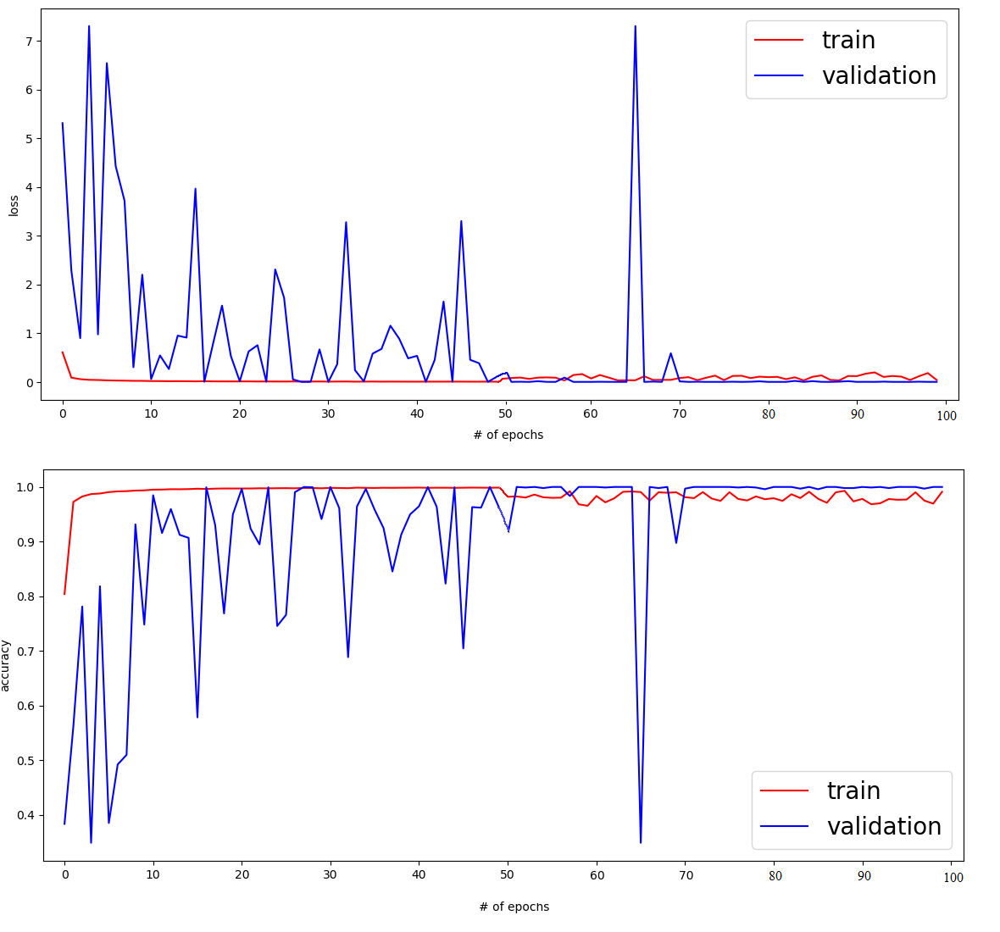
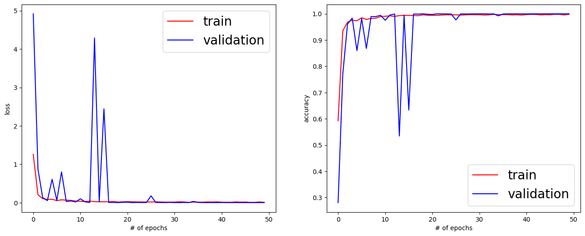
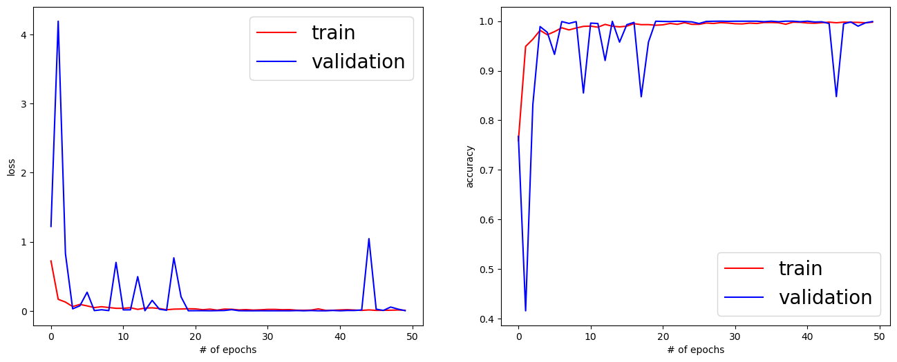
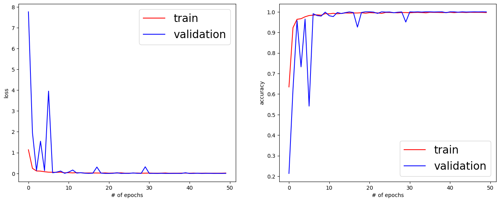

# Model & Weights

In order the application to work, a model and model's weights need to be downloaded from the following OneDrive links to the `Model` folder. 
The model should keep the name `cnn12_model.h5` while the model weights should renamed to `cnn12_weights.h5`.

The OneDrive Links contains 4 models that was investigated. 

[**1. EmptyClass with no dropout**](https://1drv.ms/f/s!Aqmah9OMflvl-3B8LNHWIjtSwMFW)

[**2. EmptyClass with dropout**](https://1drv.ms/f/s!Aqmah9OMflvl_DYgLKfMES167OZv)

[**3. no EmptyClass and no dropout**](https://1drv.ms/f/s!Aqmah9OMflvl-2lvNZUmht-UhZxQ)

[**4. no EmptyClass and with dropout**](https://1drv.ms/f/s!Aqmah9OMflvl-2oMYGqGOtRxH4m-)

### Graphs Explained
* Train Accuracy represents the average training accuracy at the end of an epoch.
* Validation Accuracy represents the accuracy of validation set at the and of an epoch.
* Train Loss is the value of cost function of the training data.
* Validation Loss is the value of cost function for cross-validation data.

### Best Model
Best model performance found to be from the [EmptyClass with dropout](https://1drv.ms/f/s!Aqmah9OMflvl_DYgLKfMES167OZv). The best epochs found are 19-25. 
This project uses epoch19 weights.
