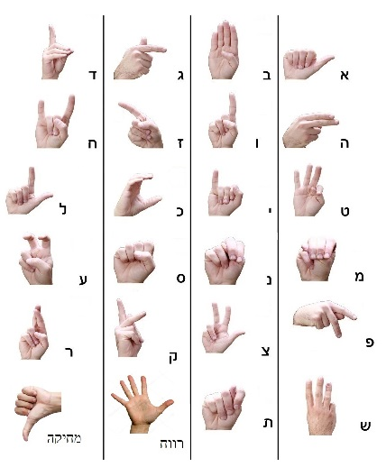

# SignLanguageRecognition
Israeli Sign Language Letters Recognition using a Convolutional Neural Network (CNN) implemented in Keras + TensorFlow + OpenCV.
This project is part of the requirements for the Final Project in B.Sc. Software Engineering.

[Theory Book Link](Israeli%20Sign%20Language%20Letters%20Recognition%20book.pdf)


## Israeli Sign Language Letters



Delete & Space signs were added for simplicity.


## Requirements

```
Python 3.6.8
tensorflow 1.13.1 (or tensorflow-gpu 1.13.1)
Keras==2.2.4
opencv-python==4.1.0.25
seaborn
sklearn
imutils
Pillow
numpy
matplotlib
```

After downloading the repo, you will need to setup database and the model:
1. [setup database](https://github.com/Romansko/SignLanguageRecognition/tree/master/images)
2. [setup model](https://github.com/Romansko/SignLanguageRecognition/tree/master/Model)


## Demo


## Compiling

1. Create exe file by running from cmd:
`pyinstaller --noconsole --onefile gui.py`
   This will create gui.exe inside dist folder.

2. Run [SetupScript.iss](SetupScript.iss) script file which will pack resources and models under single exe setup in Releases folder. ([InnoSetup](http://www.jrsoftware.org/isinfo.php) must be installed).

Installtion setup could be downloaded from the following [OneDrive Link](https://1drv.ms/u/s!Aqmah9OMflvlgZgkJLme0zqwcGFgog?e=5YCYXl)


## Credits

The Image preprocessing, OpenCV and CNN integration are based on Dr. Jared Vasquez's [CNN-HowManyFingers](https://github.com/jaredvasquez/CNN-HowManyFingers) project.
The CNN architecture used in this project is based on Hemalatha Vakade's [CNN-for-Image-Classification](https://github.com/hemavakade/CNN-for-Image-Classification) project.
