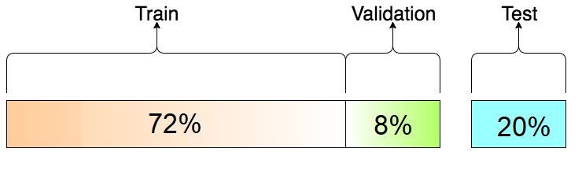
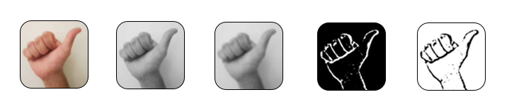

# Dataset Images

The images are available to download from the following [OneDrive Link](https://1drv.ms/u/s!Aqmah9OMflvl_SxkgHkICerZWIbN) as a compressed 7zip file. The compressed file contains 3 folders: test, train and validation which to be put under images under main project directory.


The images are split in the following way:




Each class has about ~6000 pre-processed images making a total ~150000 images in the dataset.

### Image preprocessing

To simplify the input images that are analyzed by the CNN12, a binary mask is applied, and the hand’s edges are highlighted. The binary mask consists of gray-scaling, blurring, and applying thresholding. The following code snippet is the binary mask application:
```
[1] img = cv2.cvtColor(img, cv2.COLOR_BGR2GRAY)
[2] img = cv2.GaussianBlur(img, (7,7), 3)
[3] img = cv2.adaptiveThreshold(img, 255, cv2.ADAPTIVE_THRESH_GAUSSIAN_C, cv2.THRESH_BINARY_INV, 11, 2)
[4] ret, img = cv2.threshold(img, 25, 255, cv2.THRESH_BINARY_INV + cv2.THRESH_OTSU)
```
The binary mask is taken form [Dr. Jared Vasquez's project](https://github.com/jaredvasquez/CNN-HowManyFingers).

#### Example preprocess:


